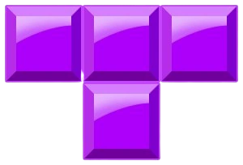

<a name="readme-top"></a>
<!--
*** I'm using markdown "reference style" links for readability.
*** Reference links are enclosed in brackets [ ] instead of parentheses ( ).
*** See the bottom of this document for the declaration of the reference variables
*** for contributors-url, forks-url, etc. This is an optional, concise syntax you may use.
*** https://www.markdownguide.org/basic-syntax/#reference-style-links
-->
[![Contributors][contributors-shield]][contributors-url]
[![Stargazers][stars-shield]][stars-url]
[![Issues][issues-shield]][issues-url]
[![LinkedIn][linkedin-shield]][linkedin-url]


<!-- PROJECT LOGO -->
<br />
<div align="center">
    
  </a>

  <h3 align="center">My Tetris version</h3>

  <p align="center">
    A Tetris game developed entirely on vanilla javascript.
    <br />
    <a href="">View Demo</a>
    ·
    <a href="">Report Bug</a>
    ·
    <a href="">Request Feature</a>
  </p>
</div>


<!-- TABLE OF CONTENTS -->
<details>
  <summary>Table of Contents</summary>
  <ol>
    <li>
      <a href="#about-the-project">About The Project</a>
      <ul>
        <li><a href="#built-with">Built With</a></li>
      </ul>
    </li>
    <li>
      <a href="#getting-started">Getting Started</a>
      <ul>
        <li><a href="#prerequisites">Prerequisites</a></li>
        <li><a href="#installation">Installation</a></li>
      </ul>
    </li>
    <li><a href="#usage">Usage</a></li>
    <li><a href="#roadmap">Roadmap</a></li>
    <li><a href="#contact">Contact</a></li>
    <li><a href="#acknowledgments">Acknowledgments</a></li>
  </ol>
</details>


<!-- ABOUT THE PROJECT -->
## About The Project

[![Product Name Screen Shot][product-screenshot]](https://example.com)

Welcome to my Tetris Game project! This classic game is implemented entirely in Vanilla JavaScript, providing a nostalgic and entertaining gaming experience.
This project showcases my passion for game development. By utilizing the simplicity and power of Vanilla JavaScript, I've created a responsive and enjoyable version of Tetris that runs directly in your browser.
I started this project with a litle bit of inspiration provided by one famous developer who has my admiration. Notice that this is my first game project.

Features:
* Pure JavaScript: No external libraries or frameworks were used.
* Intuitive Controls: Effortless controls for a seamless gaming experience. Use arrow keys to move and rotate pieces.

<p align="right">(<a href="#readme-top">back to top</a>)</p>


### Built With


[![Javascript][Javascript]][Javascript-url]
[![Vite.js][Vite.js]][Vite-url]

<p align="right">(<a href="#readme-top">back to top</a>)</p>


<!-- GETTING STARTED -->
## Getting Started

To get a local copy up and running follow these simple example steps.

### Prerequisites

* npm
  ```sh
  npm install -g npm@10.3.0
  ```

### Installation

_Follow the next steps_

1. Clone the repo
   ```sh
   git clone https://github.com/joacodru/epic-tetris.git
   ```
2. Install NPM packages
   ```sh
   npm install
   ```
3. Run projecto
   ```sh
   npm run
   ```

<p align="right">(<a href="#readme-top">back to top</a>)</p>


<!-- USAGE EXAMPLES -->
## Usage

Controls:
* Arrow down: The piece goes down.
* Arrow left: The piece goes to the left.
* Arrow right: The piece goes to the right.
* Arrow up: The piece rotates to the right.

<p align="right">(<a href="#readme-top">back to top</a>)</p>


<!-- ROADMAP -->
## Roadmap

- [x] Add MaxScore
- [ ] Add Changelog
- [ ] Add levels and level display
- [ ] Support for Multiplayer
- [ ] Add Animations

See the [open issues](https://github.com/joacodru/epic-tetris/issues) for a full list of proposed features (and known issues).

<p align="right">(<a href="#readme-top">back to top</a>)</p>


<!-- CONTACT -->
## Contact

Joaquín Druetta - joadruetta@gmail.com

Project Link: [https://github.com/your_username/repo_name](https://github.com/joacodru/epic-tetris)

<p align="right">(<a href="#readme-top">back to top</a>)</p>

<!-- ACKNOWLEDGMENTS -->
## Acknowledgments

* [Canvas API](https://developer.mozilla.org/en-US/docs/Web/API/Canvas_API)

<p align="right">(<a href="#readme-top">back to top</a>)</p>

<!-- MARKDOWN LINKS & IMAGES -->
<!-- https://www.markdownguide.org/basic-syntax/#reference-style-links -->
[contributors-shield]: https://img.shields.io/github/contributors/joacodru/epic-tetris?style=for-the-badge
[contributors-url]: https://github.com/joacodru/epic-tetris/graphs/contributors
[stars-shield]: https://img.shields.io/github/stars/joacodru/epic-tetris?style=for-the-badge
[stars-url]: https://github.com/joacodru/epic-tetris/stargazers
[issues-shield]: https://img.shields.io/github/issues/joacodru/epic-tetris?style=for-the-badge
[issues-url]: https://github.com/joacodru/epic-tetris/issues
[linkedin-shield]: https://img.shields.io/badge/-LinkedIn-black.svg?style=for-the-badge&logo=linkedin&colorB=555
[linkedin-url]: https://www.linkedin.com/in/joaquin-druetta/
[product-screenshot]: assets/screenshot.png
[Javascript]: https://img.shields.io/badge/javascript-20232A?style=for-the-badge&logo=javascript&logoColor=#F7DF1E
[Javascript-url]: https://developer.mozilla.org/es/docs/Web/JavaScript
[Vite.js]: https://img.shields.io/badge/vite.js-20232A?style=for-the-badge&logo=vite&logoColor=##646CFF
[Vite-url]: https://vitejs.dev/